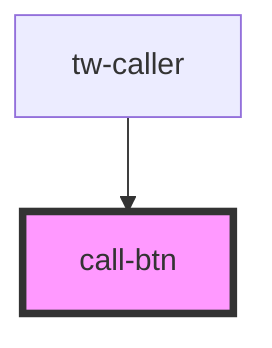

# call-btn

<!-- Auto Generated Below -->

## Properties

| Property      | Attribute      | Description | Type                                                                          | Default       |
| ------------- | -------------- | ----------- | ----------------------------------------------------------------------------- | ------------- |
| `bgColor`     | `bg-color`     |             | `string`                                                                      | `""`          |
| `borderColor` | `border-color` |             | `string`                                                                      | `""`          |
| `font`        | `font`         |             | `"Arial" \| "Georgia" \| "Helvetica" \| "Open Sans" \| "Roboto" \| "Verdana"` | `"Arial"`     |
| `fontSize`    | `font-size`    |             | `string`                                                                      | `undefined`   |
| `fontWeight`  | `font-weight`  |             | `"bold" \| "bolder" \| "normal"`                                              | `undefined`   |
| `opacity`     | `opacity`      |             | `string`                                                                      | `undefined`   |
| `rounded`     | `rounded`      |             | `boolean`                                                                     | `false`       |
| `text`        | `text`         |             | `string`                                                                      | `"Call Now!"` |
| `textColor`   | `text-color`   |             | `string`                                                                      | `""`          |

## Dependencies

### Used by

 - [tw-caller](../tw-caller)

### Graph

----------------------------------------------

*Built with [StencilJS](https://stenciljs.com/)*
