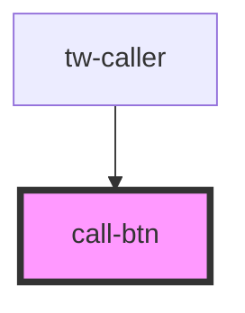

# call-btn

<!-- Auto Generated Below -->

## Properties

| Property       | Attribute       | Description | Type                                                                          | Default       |
| -------------- | --------------- | ----------- | ----------------------------------------------------------------------------- | ------------- |
| `bgColor`      | `bg-color`      |             | `string`                                                                      | `''`          |
| `borderColor`  | `border-color`  |             | `string`                                                                      | `''`          |
| `borderRadius` | `border-radius` |             | `string`                                                                      | `'sharp'`     |
| `color`        | `color`         |             | `string`                                                                      | `''`          |
| `fontSize`     | `font-size`     |             | `string`                                                                      | `undefined`   |
| `fontStyle`    | `font-style`    |             | `"Arial" \| "Georgia" \| "Helvetica" \| "Open Sans" \| "Roboto" \| "Verdana"` | `'Arial'`     |
| `fontWeight`   | `font-weight`   |             | `"bold" \| "bolder" \| "normal"`                                              | `undefined`   |
| `height`       | `height`        |             | `string`                                                                      | ``30px``      |
| `padding`      | `padding`       |             | `string`                                                                      | ``5px``       |
| `text`         | `text`          |             | `string`                                                                      | `'Call Now!'` |
| `width`        | `width`         |             | `string`                                                                      | ``120px``     |

## Dependencies

### Used by

 - [tw-caller](../tw-caller)

### Graph

----------------------------------------------

*Built with [StencilJS](https://stenciljs.com/)*
