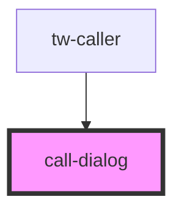

# call-dialog

<!-- Auto Generated Below -->

## Properties

| Property       | Attribute       | Description | Type      | Default     |
| -------------- | --------------- | ----------- | --------- | ----------- |
| `callDuration` | `call-duration` |             | `number`  | `undefined` |
| `isOpen`       | `is-open`       |             | `boolean` | `false`     |
| `logoSrc`      | `logo-src`      |             | `string`  | `undefined` |

## Events

| Event   | Description | Type               |
| ------- | ----------- | ------------------ |
| `close` |             | `CustomEvent<any>` |

## Dependencies

### Used by

 - [tw-caller](../tw-caller)

### Graph

----------------------------------------------

*Built with [StencilJS](https://stenciljs.com/)*
